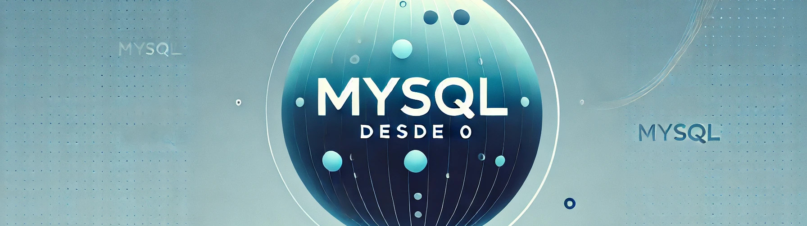

# Curso Completo de MySQL - Guía Definitiva
[](https://www.mysql.com/)
[](https://www.apache.org/licenses/LICENSE-2.0.html)
[](https://www.docker.com/)
[](https://docs.docker.com/compose/)
[](https://www.jetbrains.com/datagrip/)
[](https://www.hackthebox.com/)




¡Bienvenido al **Curso Completo de MySQL - Guía Definitiva**! Este repositorio está diseñado para ayudarte a dominar las habilidades esenciales necesarias para convertirte en un Administrador de Bases de Datos (DBA) competente. A lo largo de este curso, construirás y optimizarás un sistema de gestión educativa completo, que podrás presentar en tu portafolio profesional.

## 📋 Requisitos
- **DataGrip**: Herramienta de gestión de bases de datos, puedes descargarla [aquí](https://www.jetbrains.com/help/datagrip/installation-guide.html#silent) o utilizar cualquier otra herramienta de tu elección.
- **MySQL Server**: Instalado en tu máquina local o en un servidor remoto. Puedes descargar MySQL [aquí](https://dev.mysql.com/downloads/mysql/).
- **Docker**: Opcional, pero recomendado para configurar un entorno de desarrollo aislado. Puedes descargar Docker [aquí](https://docs.docker.com/compose/install/).

## 📚 Contenido del Curso
El curso está dividido en varios módulos, cada uno enfocado en diferentes aspectos de la gestión de bases de datos con MySQL. Comenzarás con conceptos básicos y avanzarás gradualmente a temas más complejos, como triggers, procedimientos almacenados, optimización, y replicación.

### 0. Teoría
- **README.md**: Conseptos fundamentales de MySQL como, normalización, relaciones, llaves, replicación y auditorías.

[Ver Módulo](./Learn/0.Theory/README.md)

### 1. Conceptos Básicos
- **01-creating-database.sql**: Aprende a crear una base de datos y sus tablas.
- **02-data-types.sql**: Comprende los diferentes tipos de datos en MySQL.
- **03-basic-queries.sql**: Realiza operaciones básicas como INSERT, SELECT, UPDATE y DELETE.
- **04-primary-foreign-keys.sql**: Implementa claves primarias y foráneas para gestionar relaciones entre tablas.

[Ver Módulo](./Learn/1.Basic/)

### 2. Consultas Avanzadas
- **01-joins.sql**: Aprende sobre operaciones JOIN y sus tipos.
- **02-subqueries.sql**: Comprende cómo utilizar subconsultas.
- **03-aggregation.sql**: Trabaja con funciones de agregación y GROUP BY.

[Ver Módulo](./Learn/2.Advanced)

### 3. Gestión de Usuarios y Seguridad
- **01-users-permissions.sql**: Crea usuarios y gestiona permisos.
- **02-backups.sql**: Aprende a crear y restaurar copias de seguridad.

[Ver Módulo](./Learn/3.UserManagement)

### 4. Optimización y Mantenimiento
- **01-indexes.sql**: Optimiza tu base de datos utilizando índices.
- **02-query-optimization.sql**: Técnicas para optimizar consultas.
- **03-database-maintenance.sql**: Mejores prácticas para el mantenimiento de bases de datos.

[Ver Módulo](./Learn/4.Optimization)

### 5. Triggers y Procedimientos Almacenados
- **01-triggers.sql**: Implementa triggers para acciones automáticas.
- **02-stored-procedures.sql**: Aprende a crear y usar procedimientos almacenados.

[Ver Módulo](./Learn/5.TriggersAndProcedures)

### 6. Tablas Shadow y Triggers
- **01-tables-and-shadows.sql**: Implementa tablas shadow para versionado de datos.
- **02-shadows-with-trigger.sql**: Combina tablas shadow con triggers para una gestión avanzada de datos.

[Ver Módulo](./Learn/6.ShadowsAndTriggers)

### 7. Proyecto Final
- **01-project-implementation.sql**: Implementa un sistema completo de gestión educativa.
- **Docs.md**: Documentación que describe el diseño, la implementación y las pruebas del proyecto.

[Detalles del Proyecto Final](./FinalProject)

## 🔗 Enlaces de interés
* **Impacto y Popularidad:**
  * [Stack Overflow](https://survey.stackoverflow.co/2023/#most-popular-technologies-database) | [GitHub State of Open Source](https://github.blog/2023-11-08-the-state-of-open-source-and-ai/) | [Índice DB-Engines](https://db-engines.com/en/ranking) 

* **Historia y Evolución:**
  * [Historia de MySQL](https://es.wikipedia.org/wiki/MySQL)

* **Documentación Oficial:**
  * [Documentación MySQL](https://dev.mysql.com/doc/)
  * [Guía de Auditoría en MySQL](https://dev.mysql.com/doc/refman/8.0/en/audit-log-reference.html)
  * [Documentación sobre Replicación en MySQL](https://dev.mysql.com/doc/refman/8.0/en/replication.html)
  
* **Docker y Contenedores:**
  * [Docker Hub - MySQL](https://hub.docker.com/_/mysql)
  * [Documentación Docker](https://docs.docker.com/)
  * [Repositorio Docker Compose para MySQL](https://github.com/ElJoamy/Docker_compose_comfiguration.git)

* **Herramientas y Playgrounds:**
  * [MySQL Workbench](https://dev.mysql.com/doc/workbench/en/)
  * [DataGrip](https://www.jetbrains.com/datagrip/)
  * [dbdocs.io](https://dbdocs.io/) - Generador de documentación de bases de datos
  * [SQL Fiddle](http://sqlfiddle.com/) - Entorno de pruebas en línea para SQL
  
* **Seguridad y Auditorías:**
  * [Guía de Seguridad MySQL](https://dev.mysql.com/doc/refman/8.0/en/security.html)
  * [Implementación de Auditorías en MySQL](https://dev.mysql.com/doc/refman/8.0/en/audit-log.html)
  
* **Estilos y Buenas Prácticas:**
  * [Guía de Estilo MySQL](https://dev.mysql.com/doc/refman/8.0/en/sql-syntax.html)

## 🤔 Preguntas Frecuentes 
### ¿Debo tener conocimientos previos?
Mi objetivo es que este curso sea accesible para principiantes y personas con poca experiencia en bases de datos. Comenzaremos desde cero y avanzaremos gradualmente a temas más avanzados.

### ¿Habra algun video tutorial?
Por el momento, este curso está diseñado como una guía escrita. Sin embargo, estoy trabajando en la creación de videos tutoriales para complementar el contenido. ¡Mantente atento a futuras actualizaciones!

### ¿Cómo puedo configurar la replicación maestro-esclavo?
Configurar la replicación maestro-esclavo en MySQL es un proceso avanzado que requiere un conocimiento profundo de la configuración del servidor y la red.

Para ayuda adicional, puedes consultar la [documentación oficial de MySQL](https://dev.mysql.com/doc/refman/8.0/en/replication.html) o revisar este [repositorio](https://github.com/ElJoamy/Docker_compose_comfiguration.git) para ver un ejemplo de cómo configurar un maestro y un esclavo.

### ¿Porque es importante las tablas shadow?
Las tablas shadow son una técnica avanzada que se utiliza para mantener un historial de versiones de los datos en una base de datos. Esto es útil para rastrear cambios, realizar auditorías y recuperar datos en caso de errores.

### ¿Cómo puedo practicar?
Puedes practicar los ejercicios proporcionados en cada módulo para mejorar tus habilidades. Además, te recomiendo que trabajes en el proyecto final para aplicar tus conocimientos en un escenario del mundo real.

## 🛠️ Instalación

1. Clona el repositorio:
   ```bash
   git clone https://github.com/ElJoamy/mysql-course.git
   ```

2. Navega al directorio del proyecto:
   ```bash
   cd mysql-course
   ```

3. Importa los scripts SQL en tu servidor MySQL para comenzar a practicar. Puedes usar DataGrip u otra herramienta de gestión de bases de datos para ejecutar los scripts.

## <table>
<tr>
    <td>
        
    </td>
    <td>
        <b>Hola, mi nombre es Joseph Meneses (Joamy).</b>
    </td>
</tr>
</table>


### Database Administrator, Ethical Hacker and Python Developer
[](https://www.linkedin.com/in/joamy5902/)
[](https://www.instagram.com/joseph_joamy/)
[](https://x.com/JosephJoamy)


Soy Ingeniero de Sistemas computacionales y desde el 2022 combino mi trabajo de DBA, Ethical Hacking y desarrollo de software en Python con la creación de contenido formativo sobre programación y tecnología en diferentes comunidades.

Si quieres apoyarme, aprender mas sobre bases de datos y seguridad informática, mejorar tus habilidades y ayudar a la continuidad del proyecto, puedes encontrarme en:

[](https://www.linkedin.com/in/joamy5902/)
[](https://www.instagram.com/joseph_joamy/)
[](https://github.com/ElJoamy)

